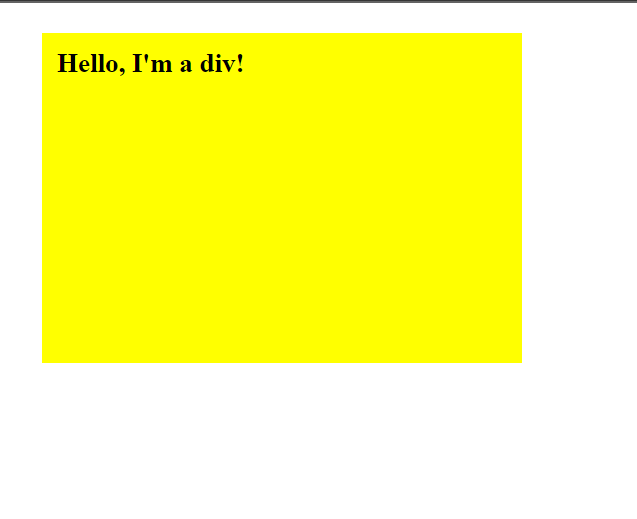

# DOM-1
First Project of DOM Manipulation.

## Project Preview
 ;

## Project Overview
- Basically we target an element and fetch it into our JavaScript file.
- After fecthing the element we did manipulated its style by using JS .

## Live Demo / Hosted Link
- Check out the link [Hosted Link](https://mohitnegi16.github.io/DOM-1/g).

